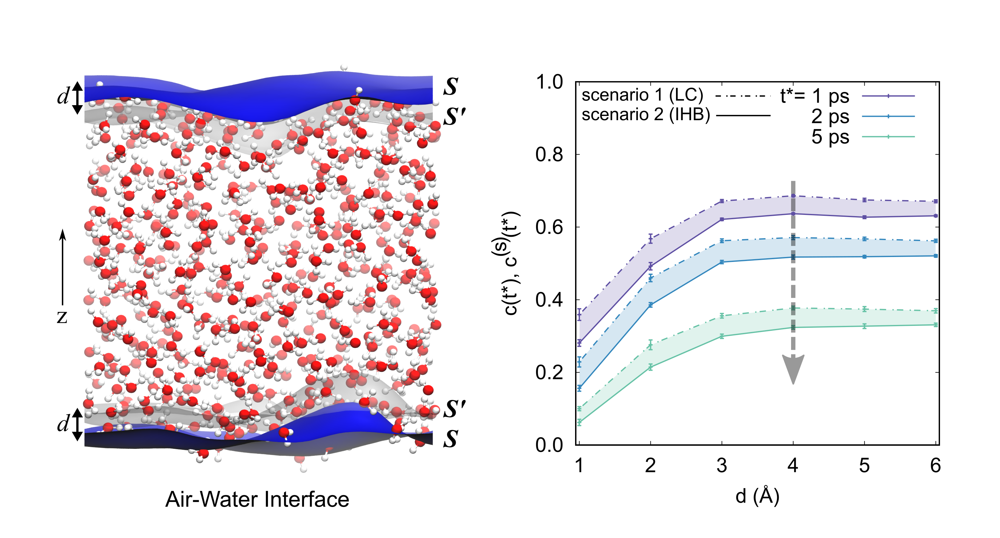

# Instantanoues hydrogen bond dynamics 

Source codes for the paper [Revisiting the Thickness of the Air-Water Interface from Two Extremes of Interface Hydrogen Bond Dynamics](https://arxiv.org/abs/2204.13941)

<p align='center'>

</p>

## Abstract

The air-water interface plays a crucial role in many aspects of science, because of its unique properties, such as a two-dimensional hydrogen bond (HB) network and completely different HB dynamics compared to bulk water. However, accurately determining the boundary of interfacial and bulk water, that is, the thickness of the air-water interface, still challenges experimentalists. Various simulation-based methods have been developed to estimate the thickness, converging on a range of approximately 3 to 10 Angstroms. In this study, we introduce a novel approach, grounded in density functional theory-based molecular dynamics (DFTMD) simulations, to measure the air-water interface thickness, offering a different perspective based on prior research. To capture realistic HB dynamics in the air-water interface, two extreme scenarios of the interface HB dynamics are obtained: one *underestimates* the interface HB dynamics, while the other *overestimates* it. Surprisingly, our results suggest that the interface HB dynamics in both scenarios converge as the thickness of the air-water interface increases to 4.0 Angstroms. This convergence point, indicative of the realistic interface thickness, is confirmed by our calculation of anisotropic decay of OH stretch at the air-water interface and  supported by the results from recent *ab initio* molecular dynamics simulations.

## Citation

Cite as:
```
@misc{huang2024revisitingthicknessairwaterinterface,
      title={Revisiting the Thickness of the Air-Water Interface from Two Extremes of Interface Hydrogen Bond Dynamics}, 
      author={Gang Huang and Jie Huang},
      year={2024},
      eprint={2204.13941},
      archivePrefix={arXiv},
      primaryClass={cond-mat.mtrl-sci},
      url={https://arxiv.org/abs/2204.13941}, 
}
```
